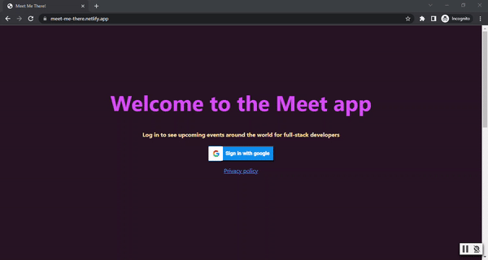
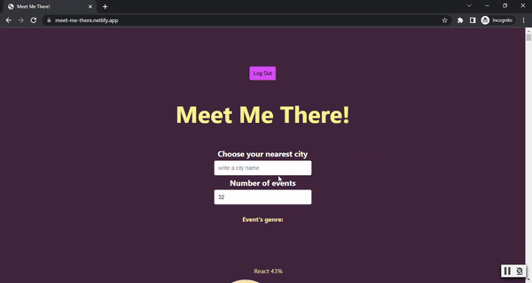
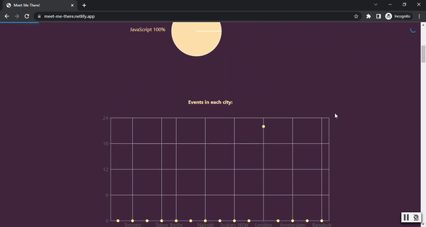

## Meet App (event finding app)
Find the events take place around you!

## Objectives
- The app is serverless, built with React PWA and works both online and offline
  - Serverless: less backend maintenance, increased scalability, high availability.
  - PWA: instant loading, offline working, and cross-platform features.

- following the BDD and DDT approach.

- Fetchin data about nearby events in every cities from Google Calendar API.

- Data visualisation:
  - upcoming events: with the option to filter the number of events to be shown
  - popular events

## Key Features

### 1. Filter events by city
***SCENARIO 1**: When user hasn’t searched for a city, show upcoming events from all cities.*
>**User Story**: As a user, I would like to be able to filter events by city so that I can see the list of events that
take place in that city.

**Given** user hasn’t searched for any city,

**When** the user opens the app,

**Then** the user should see a list of all upcoming events.

***SCENARIO 2**: User should see a list of suggestions when they search for events in a particular city.*
>**User Story**: As a user, I should be able to see a list of suggestsions when I start typing, so that events that I am show are near my location.

**Given** the main page is open,

**When** user starts typing in the city textbox,

**Then** the user should see a list of cities (suggestions) that match what they’ve typed.

***SCENARIO 3**: User can select a city from the suggested list.*
>**User Story**: As a user, I should be able to select a city from the sugessted list, so that I can see events relevant to my location.

**Given** the user was typing “Berlin” in the city textbox 
and the list of suggested cities is showing,

**When** the user selects a city (e.g., “Berlin, Germany”) from the list,

**Then** their city should be changed to that city (i.e., “Berlin, Germany”)
And the user should receive a list of upcoming events in that city.

### 2. Show/hide event details
**SCENARIO 1**: An event element is collapsed by default.**
>**User Story**: As a user, I would like to be able to show/hide event details so that I can see more/less information about an event.

**Given** a user has searched for a city,

**When** the list of events is shown,

**Then** all events details should be hidden.

**SCENARIO 2**: User can expand an event to see its details.**
>**User Story**: As a user, I should be able to reveal event details, so that I can get a more in-depth idea of what the event is about.

**Given** a list of unexpanded events are shown,

**When** a user clicks in an event, 

**Then** event detail should be revealed.

**SCENARIO 3**: User can collapse an event to hide its details.**
>**User Story**: As a user, I should be able to hide event details, so that I can go back to seeing the main overview of available events.

**Given** the details of an event has expanded, 

**When*** a user hides details,

**Then** the detail of that particular event should collapse.

<!-- not implemented yet -->
### 3. Specify number of events
**SCENARIO 1**: When user hasn’t specified a number, 32 is the default number.**
>**User Story**: As a user, I should be able to see a list of events by default, so that I can get started searching immediately.

**Given** a number of events to be shown has not been specified,

**When** a user searches for events in a city,

**Then** a list of 32 events should be shown

**SCENARIO 2**: User can change the number of events they want to see.**
>**User Story**: as a user I should be able to specify the nubmer of events to be shown, so that I can choose whether many or few are shown.

**Given** a list of events is shown, 

**When** a user specifies the number of events to show, 

**Then** the list should be matched the schosen number.

### 4. Use the app when offline
**SCENARIO 1**: Show cached data when there’s no internet connection.**
>**User Story**: As a user, I would like to be able to use the app when offline so that I can see the events I viewed the last time I was online 

**Given** the app is live, 

**When** internet connection is broken or the user is offline,

**Then** the app should still working by showing the data taken from offline cashe.

**SCENARIO 2**: Show error when user changes the settings (city, time range).**
>**User Story**: As a user, I should be able to see an error message when I do something wrong, so that I can go back to being able to use the app.

**Given** default time and city settings, 

**When** a user changes city and time settings, 

**Then** an error message should be displayed.

### 5. Data visualisation 
**SCENARIO 1**: View a chart showing the number of upcoming events by city.**
>**User Story**: As a user, I would like to be able to see a chart showing the upcoming events in each city so that I know what events are organized in which city.

**Given** a city has been chosen,

**When** a user chooses to view data on upcoming events, 

**Then** appropriate charts and data visualisations should be displayed.

## Dependencies:
- React
- RectDOM
- Google Calendar API
- AWS lambda
- Axios
- Recharts
- Puppeteer: to do testing process

## Setting up development environment:
1. Clone the repository from [here](https://github.com/BJaguar71/MeetApp)
2. Run `npm install` to install packages and dependencies.
3. Run `npm run start` to open the app in the localhost port 3000

## App link
[Link](https://meet-me-there.netlify.app/)

